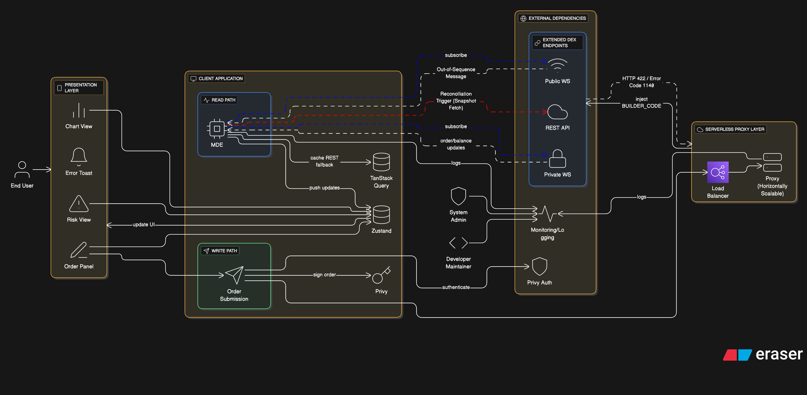

# Architecture Documentation

*System Architecture Diagram: Read Path and Write Path Data Flows*

---

## 📄 I. Project Foundation & Tech Stack

This section confirms the core project setup and the specific technologies chosen to meet the bounty's requirements for robustness and UX, solidifying the architecture's base layer.

### 1. Project Goal

The objective is to build a high-performance, mobile-first alternative trading frontend for Extended Perpetual DEX on Starknet, focusing on Technical Robustness and securely integrating the mandatory **Builder Code** for fee routing.

### 2. Core Technical Stack & Rationale

| Layer | Tool/Selection | Rationale (As Agreed) |
|-------|----------------|----------------------|
| Framework | Next.js (TypeScript) | Provides full-stack capabilities necessary for the Serverless Proxy and supports strict type safety. |
| Wallet Integration | Privy | Explicitly chosen to achieve the "invisible wallet" and Consumer-Grade UX essential for mainstream adoption on Starknet. |
| Blockchain SDK | starknet.js | The core library for all on-chain (INVOKE) and off-chain (signing) transactions. |
| State Management | Zustand + TanStack Query | Zustand handles the fast, decoupled state from the Market Data Engine. TanStack Query manages REST caching and optimized transaction retries. |
| UI Performance | Virtualization & Canvas Rendering | Critical for maintaining 60 fps when displaying high-volume data like the Order Book and Charts. |

### 3. Core Architectural Principle

The system's integrity relies on **Decoupling**:

- The **Read Path** (data streams) is decoupled from the **Write Path** (order execution).
- High-frequency data is decoupled from the React rendering cycle by the Market Data Engine (MDE).

---

## 🏗️ II. Architecture Core: Layer Separation

This section defines the fundamental, high-level architecture that separates the application's concerns: maximizing performance for market data consumption versus ensuring security and compliance for transaction execution.

### 1. The Read Path System: Performance Focus

The Read Path is designed for maximum throughput and minimal latency, handling high-frequency data outside the main UI thread.

#### Core Component: Market Data Engine (MDE)

**Role:** A dedicated, pure TypeScript Singleton running outside of React. Its sole purpose is to consume, validate, process, and throttle **WebSocket** data before pushing meaningful updates to the **Zustand** store.

**Data Protocol:** Exclusive use of WebSockets (**WSS**).

- **Rationale:** This prevents **HTTP** polling overhead and eliminates the risk of hitting the **REST API** rate limit of **1,000 requests per minute**.

**Validation Logic:** The **MDE** is responsible for the crucial Sequence Number (**seq**) Validation. All incoming data is checked for monotonicity to ensure the local state is never corrupted.

**Data Integrity:** The Reconciliation Strategy mandates that any sequence number breach forces an immediate **WS** disconnect, a **REST API** snapshot fetch, and then a **WS** reconnection, restoring the correct state before delta processing resumes.

### 2. The Write Path System: Security Focus

The Write Path is designed to manage user intent, cryptographic signing, and the secure injection of your secret **Builder Code**.

#### Core Component: Serverless Proxy

**Role:** A minimal backend component (e.g., Vercel/Lambda function) that acts as the single gateway for order submission.

**Compliance Logic:** The Proxy's primary function is to retrieve the secret **BUILDER_CODE** from a private environment variable and securely inject it into the request payload before forwarding it to the Extended **REST API**.

- **Rationale:** This prevents client-side exposure of the revenue-generating **Builder Code**, satisfying the Technical Robustness requirement.

**Transaction Protocol:** Uses Off-Chain Signing with **starknet.js**.

- **Rationale:** The user's wallet signs the order message hash, keeping order placement fast and gas-free, while the Serverless Proxy handles the **HTTPS** transmission.

---

## 📊 III. Detailed Data Flows & Logic

You are satisfied with the core architectural separation. We now proceed to the detailed implementation logic for the two primary flows: the high-performance Read Flow and the secure, compliant Write Flow. This section ensures we integrate the Market Data Engine (MDE) and the Serverless Proxy correctly.

### 1. The Read Flow: Market Data Engine (MDE) Logic

The MDE is responsible for converting raw, high-frequency **WebSocket** data into a stable, usable state for the UI.

| Component | Logic & Action | Architectural Flow |
|-----------|----------------|-------------------|
| Data Ingestion | Connects to `wss://api.starknet.extended.exchange` for public data and `ws://api.starknet.extended.exchange` for private data (using the X-Api-Key). | Raw WS data streams directly into the MDE memory. |
| Sequence Validation | The MDE checks the seq number on every incoming message. If a sequence breach is detected, it triggers the Reconciliation Strategy. | seq check is performed before any data update occurs in local memory. |
| Reconciliation Strategy | If a seq break occurs, the MDE immediately disconnects the WS, calls the REST API for a full snapshot (e.g., of the order book), updates its local memory, and then reconnects the WS. | Ensures the local state is authoritative and accurate after any network lapse. |
| Data Throttling | The MDE pushes data to the Zustand store at controlled rates to prevent UI lag. | BBO (Best Bid/Ask) updates are pushed at ≤30ms. Order Book and Trades lists are pushed at ≤500ms. |
| Derived Value Calculation | Liquidation Price is treated as a reactive value. Its re-calculation is triggered immediately upon receiving a new Mark Price update. | The MDE calculates the new L value using the cached Position Size and the new Mark Price, then pushes the updated L to Zustand. |
| Private Stream Processor | ORDER and BALANCE updates from the private stream are run through a simple processor in the MDE to filter out trivial changes before pushing to Zustand. | Prevents: The user's Open Orders list from re-rendering with every tiny Mark Price tick that updates unrealised P&L. |

### 2. The Write Flow: Order Placement and Security

This flow secures the **Builder Code** and uses **Starknet**'s fast, off-chain signature capability for trade execution.

| Action/Component | Logic & Purpose | Architectural Flow |
|------------------|-----------------|-------------------|
| Order Assembly | The Order Submission Service gathers validated data from the UI, including any Take Profit/Stop Loss (TP/SL) parameters. | Frontend → Order Submission Service. |
| Off-Chain Signing | Uses starknet.js to prompt the Privy wallet to sign the order data object. This signature confirms the user's intent. | Speed: The user does not pay gas for this step; it is merely cryptographic proof of ownership. |
| Proxy Call | The frontend sends the signed order payload (raw parameters + signature, NO Builder Code) via HTTPS to the Serverless Proxy endpoint. | Security: The Builder Code remains hidden on the server. |
| Code Injection | The Serverless Proxy retrieves the BUILDER_CODE from its private environment variable and injects it into the final request (as a Header or Query Parameter). | Compliance: Ensures the fee is routed to your account, securing your revenue stream. |
| Execution | The Proxy forwards the complete, signed, and injected request to the Extended REST API for matching. | Proxy → Extended API. |

### 3. The Feedback Flow: UX and Error Handling

The final stage ensures the user receives reliable, non-technical feedback on their actions.

| Action/Component | Logic & Purpose | Architectural Flow |
|------------------|-----------------|-------------------|
| Optimistic Updates | When the user cancels an order, the UI immediately updates the order status to "Cancelling..." | Responsiveness: Hides the network latency of the cancellation request. |
| Final Confirmation | The final status (CANCELLED, FILLED, or NEW) is only confirmed when the update arrives via the Private WebSocket stream. | Eventual Consistency: The UI state is reconciled with the validated stream truth. |
| Error Translation | The Presentation Layer contains a map to translate technical Extended error codes (e.g., 1140) into Clear UX messages. | Clear UX: An error of Code 1140 is displayed as "Insufficient Margin. Please reduce size or leverage." |

---

## 🎨 IV. The Presentation Layer (UI/UX Blueprint)

You are satisfied with the detailed Data Flows. We now proceed to the Presentation Layer—the user interface design that ensures the application meets the Clear UX and Product Thinking evaluation criteria. This UI blueprint is based on the agreed-upon Mobile-First philosophy.

### 1. Layout Philosophy: The Three-Panel System

To combat the screen limitations of mobile devices and prevent cognitive overload, the entire trading experience is separated into three distinct, swappable views:

| Panel | Focus | Purpose | Key Data Source |
|-------|-------|---------|----------------|
| Panel 1: Chart View | Analysis & Monitoring | Primary view for price analysis, showing the Mark Price and user's Entry/Liquidation prices. | MDE (Candles, Throttled Mark Price) |
| Panel 2: Order Panel | Execution | Single, uncluttered view for placing new orders or modifying existing ones. | Zustand (Balance), Write Path (Submission) |
| Panel 3: Risk View | Position & Margin | Instant access to the user's P&L, liquidation risk, and open orders. | Zustand (POSITION, BALANCE, ORDERS) |

### 2. The Order Panel (Panel 2): Progressive Disclosure

This panel is designed for speed and includes a crucial feature for advanced users.

#### Simplified Default View:

- **Inputs:** Only shows **Market**/**Limit** Order Type, **Size**, and **Leverage Slider**.
- **Action:** Large, distinct BUY/LONG and SELL/SHORT buttons that trigger the Write Path flow.

#### "Power-User Mode" Implementation:

- **Trigger:** A small, secondary link labeled "Advanced Order Settings" is placed below the primary action buttons.
- **Expanded Features:** Activating the mode reveals hidden parameters crucial for advanced trading strategies:
  - Take Profit (**TP**) / Stop Loss (**SL**) fields.
  - Reduce Only checkbox (safety feature to prevent accidental leverage increase).
  - Post Only checkbox (for guaranteed maker fees).

### 3. The Risk View (Panel 3): Clear Risk Management

This panel translates complex financial metrics into easily digestible visual cues.

**Margin Health Indicator:** A prominent, colored gauge at the top.

- **Logic:** Uses a simple color scale based on the Margin Ratio from the **Zustand Balance Slice**.
- **Color Key:** **Green** (**Low Risk**), **Yellow** (**Warning**), **Red** (**High Liquidation Risk**).

**Order Management:** Lists are virtualized for performance.

- **Open Orders:** Each order has an instant "Cancel" button that triggers the fast, Optimistic UI Update cancellation flow.

---

## ✅ V. Final Implementation Checks & Protocol Compliance

This section confirms the necessary low-level architectural details to achieve Technical Robustness.

### 1. Starknet Protocol Compliance

| Check | Requirement | Compliance Detail |
|-------|-------------|------------------|
| Wallet Integration | Seamless authentication and signing. | Uses Privy for consumer-grade, social-login-enabled UX. |
| On-Chain Deposit | Must handle L2 collateral transfer correctly. | Uses starknet.js for the two-step Approve and Deposit INVOKE transaction flow. |
| Off-Chain Trading | Orders must not require gas/L2 transaction fees. | Orders are signed off-chain using the user's Privy wallet key, validating the integrity of the Order Submission Service. |

### 2. Error Translation for Clear UX

The **Presentation Layer** must translate all critical **HTTP** error codes returned by the Serverless Proxy into clear, non-technical guidance.

| Extended Error Code | Failure Category | Presentation Layer Message |
|---------------------|------------------|---------------------------|
| 1140 (OrderCostExceedsBalance) | Funding/Margin | "Insufficient Margin." Suggestion: Reduce leverage or quantity. |
| 1120 (OrderQtyLessThanMinTradeSize) | Rules Compliance | "Size Too Small." Suggestion: Increase quantity to meet the market minimum. |
| 1126 (MaxOpenOrdersNumberExceeded) | User Limits | "Order Limit Reached." Suggestion: Cancel existing limit orders to free space. |

### 3. Code Maintenance

- **Monorepo:** Recommended structure (**web**, **proxy**, **shared-types**) for deployment and maintenance.
- **Strict Typing:** **TypeScript** must be enforced across all packages, especially for data serialization between the client and the **Serverless Proxy**.

### 4. Concurrency and Scalability

The Market Data Engine (MDE) is an isolated layer built on **Next.js**'s serverless functions, so you should focus on the client-side MDE connection limit and the Exchange's capacity.

#### Expected Concurrency:

- The frontend (client-side) MDE will maintain one dedicated Public WebSocket connection and one dedicated Private WebSocket connection per active user session.
- While we cannot know Extended's exact server limits, the system design implies support for tens of thousands of simultaneous users, as modern event-driven servers can handle tens to hundreds of thousands of concurrent WebSocket connections (Source 1.2).

#### Diagram Reflection (Scalability & Redundancy):

- **Focus on the MDE's Role:** Since the MDE's core role is data integrity (sequence checking and reconciliation), the diagram should visually emphasize the MDE's connection to the Extended WS Endpoints as a single, dedicated, persistent connection.

- **Redundancy:** Indicate the **Serverless Proxy** (Write Path) is deployed in a horizontally scalable environment (e.g., in a cloud provider's Availability Zone or as a replicated service). Use the standard symbol for a Load Balancer placed before the Proxy component to visually represent its horizontal scaling capability.
